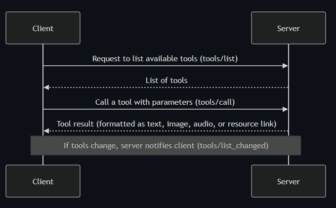

# 03: Defining Tools with MCP

## Introduction
In this step, you'll learn how to create and use MCP tools with the FastMCP Python SDK. This guide will show you how to turn your Python functions into easy-to-use tools with minimal hassle.

## How Tools Work: Discovery and Execution
Here’s a simple overview of the process:
1. **Finding Tools:** The MCP client sends a `tools/list` request to get a list of available tools.
2. **Using Tools:** When you want to run a tool, the client sends a `tools/call` request with the tool name and the necessary parameters.
3. **Handling Errors:** If something goes wrong (for example, if a document is missing), the tool raises a Python error that is automatically converted into an MCP error response.

Below is a simple diagram illustrating the process:

## **Defining Tools with @mcp.tool**
Using the @mcp.tool decorator, you can convert a regular Python function into an MCP tool. The decorator uses Python’s type hints and Pydantic’s Field to automatically create a clear, friendly interface. This means you don’t have to write complex JSON schemas by hand

---

### 1. What decorator do you use in FastMCP to define a tool?

A) `@mcp.resource`
B) `@mcp.tool`
C) `@mcp.prompt`
D) `@mcp.server`

**Correct Option: B**

---

### 2. How does FastMCP determine the input schema for a tool?

A) From a separate JSON file you write manually
B) From the function name only
C) From the function’s Python type annotations
D) From comments in the function

**Correct Option: C**

---

### 3. What happens when you return a simple Python primitive type (e.g., `int` or `str`) from a FastMCP tool?

A) It’s converted to `TextContent` only
B) It’s automatically wrapped into a structured JSON object under a `"result"` key (if type annotated) ([fastmcp.wiki][1])
C) The server throws a validation error
D) The primitive type is not allowed

**Correct Option: B**

---

### 4. If you want full control over both traditional content and structured output in a tool’s response, which type should you return?

A) `str`
B) `int`
C) `ToolResult` from `fastmcp.tools.tool` ([fastmcp.wiki][1])
D) A Python `dict` without annotations

**Correct Option: C**

---

### 5. What is the purpose of annotations (like `readOnlyHint`, `destructiveHint`) in `@mcp.tool`?

A) They enforce security at runtime
B) They provide metadata to clients about how the tool behaves (e.g., whether it modifies data) ([gofastmcp.com][2])
C) They change the tool’s return type
D) They compile the tool into a standalone binary

**Correct Option: B**

